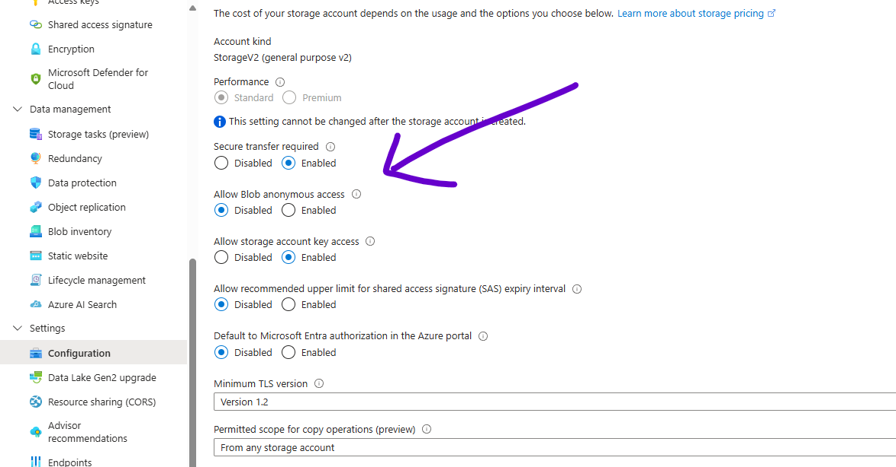

# how to run.

notes on how to run the project locally.

NOTE: Don't forget to delete your Azure Resources after you are done running the project.

1. You have to create a Storage Account on Azure.
1. You want to turn on 'AllowBlobPublicAccess', for the Storage Account
   
1. AzureBlobWebAPIDemo
   1. Update 'AccessKeys' for Azure Storage Account in the class, 'BlobStorageStuff'
   1. Computer Vision in the class, ComputerVisionStuff
      1. Update 'VISION_KEY'
      1. Update 'VISION_ENDPOINT'
   1. Translator in the class, TranslatorStuff
      1. Update 'key'
      1. Update 'endpoint'
1. Run both the projects and do the following Container Actions
   1. Create a Container on Azure Portal or using Swagger UI
   1. Set the Container to public using AzureBlobWebAPIDemo Swagger UI or Azure Portal
   1. Now, stop running the project, and go to the next step.
   1. Update, 'DefaultContainerName', in the class, 'BlobStorageStuff' (AzureBlobWebAPIDemo project), with the container you just created and made public.
   1. Update, 'DefaultContainerName', in the class, 'BlobStorageStuff'. The web app will pull images from this container (AzureBlogWebAppDemo project), with the container you just created and made public.
1. and that's it.

# book a session with me

1. [calendly](https://calendly.com/jaycodingtutor/30min)

# hire and get to know me

find ways to hire me, follow me and stay in touch with me.

1. [github](https://github.com/Jay-study-nildana)
1. [personal site](https://thechalakas.com)
1. [upwork](https://www.upwork.com/fl/vijayasimhabr)
1. [fiverr](https://www.fiverr.com/jay_codeguy)
1. [codementor](https://www.codementor.io/@vijayasimhabr)
1. [stackoverflow](https://stackoverflow.com/users/5338888/jay)
1. [Jay's Coding Channel](https://www.youtube.com/channel/UCJJVulg4J7POMdX0veuacXw/)
1. [medium blog](https://medium.com/@vijayasimhabr)
