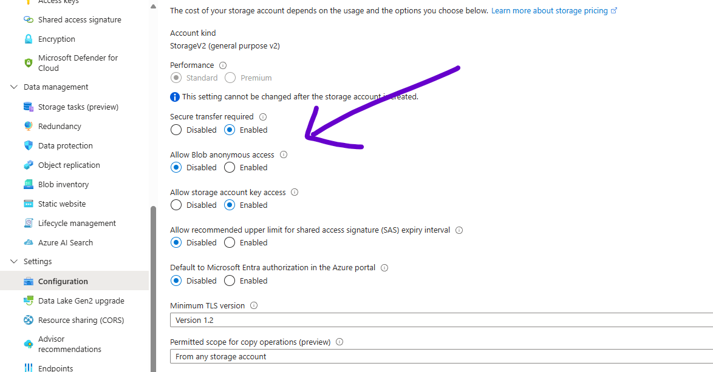

# how to run.

notes on how to run the project locally.

NOTE: Don't forget to delete your Azure Resources after you are done running the project.

## app settings file

The following values need to be updated for all features to work, in the PhoBloberWebAPI appsettings.json.

```json
{
  "Logging": {
    "LogLevel": {
      "Default": "Information",
      "Microsoft.AspNetCore": "Warning"
    }
  },
  "AllowedHosts": "*",
  "TranslatorSettings": {
    "Key": "00000000",
    "Endpoint": "https://api.cognitive.microsofttranslator.com/"
  },
  "CVSettings": {
    "VISION_KEY": "000000",
    "VISION_ENDPOINT": "https://computervisionhwsep202024.cognitiveservices.azure.com/"
  },
  "StorageSettings": {
    "AccessKeys": "DefaultEndpointsProtocol=https;AccountName=storageaccount;AccountKey=00000;EndpointSuffix=core.windows.net"
  },
  "SerilogSettings": {
    "SQLiteConnectionString": "Logs.db"
  }
}
```

## Turn on Anonymous Access

You want to turn on 'AllowBlobPublicAccess', for the Storage Account

[]()

Note: Check out this [microsoft learn](https://learn.microsoft.com/en-us/training/modules/describe-azure-storage-services/5-exercise-create-storage-blob) link, which is more detailed.

## Container Related Actions

1. Run the project, and create a Container on Azure Portal or using Swagger UI (Recommended)
   1. Use this name, 'phoblobercontainer1'. This is hard coded to the web app and also the web api.
   1. TODO, automatically create this container if container is not manually created and set it to public
   1. TODO, load the default container name from app settings for both web API and web app
1. Set the Container to public using Azure Portal or using Swagger UI (Recommended)

# book a session with me

1. [calendly](https://calendly.com/jaycodingtutor/30min)

# hire and get to know me

find ways to hire me, follow me and stay in touch with me.

1. [github](https://github.com/Jay-study-nildana)
1. [personal site](https://thechalakas.com)
1. [upwork](https://www.upwork.com/fl/vijayasimhabr)
1. [fiverr](https://www.fiverr.com/jay_codeguy)
1. [codementor](https://www.codementor.io/@vijayasimhabr)
1. [stackoverflow](https://stackoverflow.com/users/5338888/jay)
1. [Jay's Coding Channel](https://www.youtube.com/channel/UCJJVulg4J7POMdX0veuacXw/)
1. [medium blog](https://medium.com/@vijayasimhabr)
