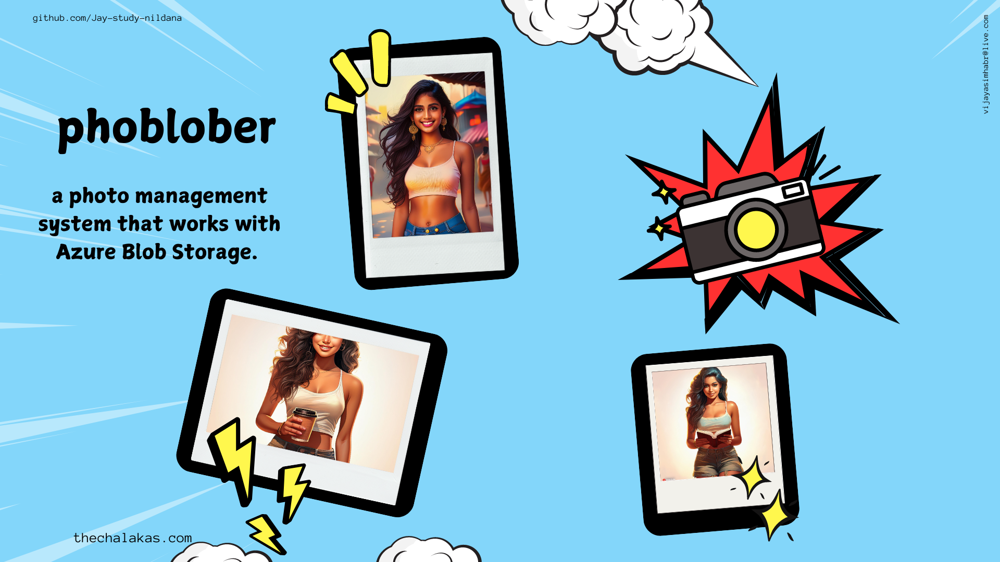

# PhoBlober

a photo management system that works with

1. Azure Blob Storage.
   1. Upload Images
   1. Get Images and Display Them
1. Azure Computer Vision
   1. Analyse Images
   1. Optical Character Recognition
1. Azure Translator
   1. Translate from English to Kannada, Hindi and French

NOTE: Don't forget to delete your Azure Resources after you are done running the project.

# more explanations

1. [howtorun.md](howtorun.md)
1. features
   1. [Azure Blob Storage](pupload.md)
   1. [Analyse Images](panalyse.md)
   1. [Optical Character Recognition](pocr.md)
   1. [Text Translator](translate.md)

# book a session with me

1. [calendly](https://calendly.com/jaycodingtutor/30min)

# hire and get to know me

find ways to hire me, follow me and stay in touch with me.

1. [github](https://github.com/Jay-study-nildana)
1. [personal site](https://thechalakas.com)
1. [upwork](https://www.upwork.com/fl/vijayasimhabr)
1. [fiverr](https://www.fiverr.com/jay_codeguy)
1. [codementor](https://www.codementor.io/@vijayasimhabr)
1. [stackoverflow](https://stackoverflow.com/users/5338888/jay)
1. [Jay's Coding Channel](https://www.youtube.com/channel/UCJJVulg4J7POMdX0veuacXw/)
1. [medium blog](https://medium.com/@vijayasimhabr)
